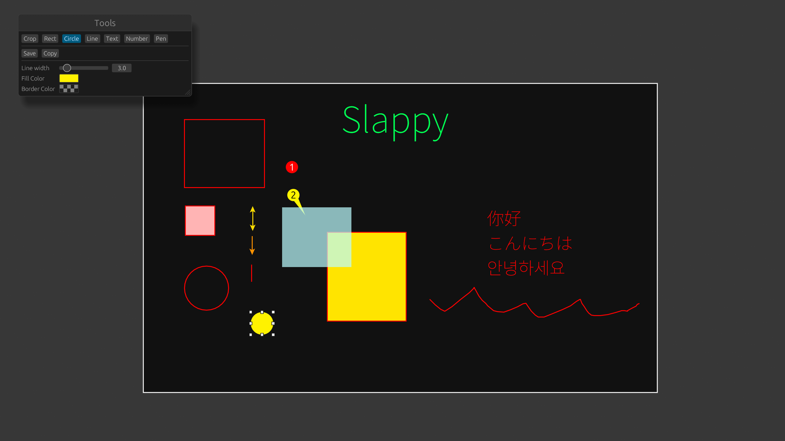

# Slappy ✨

**Slappy** is a blazing-fast ⚡️ Wayland screenshot editor, written in Rust and powered by `egui`. It's designed to be intuitive and powerful.



<video src="https://github.com/user-attachments/assets/6f372a18-fe56-43be-8367-238cfe55a933" controls="controls"></video>

## Features

  * **Blaze Fast:** Built with Rust, Slappy is highly performant. 🚀
  * **Wayland Native:** Works seamlessly in Wayland environments. 🖥️
  * **Graphical Editing:** Easily draw, annotate, and modify your screenshots before saving them. ✏️

## Installation

To install Slappy, you'll need to have a Rust toolchain installed. You can then use `cargo` to install it directly from the Git repository:

```sh
cargo install --git https://github.com/ri-char/slappy.git
```
If you are using **Nix**, run 
```sh
nix run github:ri-char/slappy -- --help
```

If you are using **flake**, use it as follow:
```nix
{
    inputs = {
        nixpkgs.url = "github:nixos/nixpkgs/nixos-unstable";
        slappy = {
            url = "github:ri-char/slappy";
            inputs.nixpkgs.follows = "nixpkgs";
        };
    };
    outputs = { self, nixpkgs, slappy }: {
    # change `yourhostname` to your actual hostname
    nixosConfigurations.yourhostname = nixpkgs.lib.nixosSystem {
        modules = [
            { environment.systemPackages = [slappy.packages.x86_64-linux.default]; }
        ];
    };
  };
}
```

## Usage

Slappy is designed to be used in your terminal or integrated into your Wayland compositor's keybindings.

```sh
slappy [OPTIONS]
```


### Options

* `-i, --input <INPUT>`: The input file for the screenshot. Use `-` for stdin.
    * **Default:** `-`
* `-o, --output <OUTPUT>`: The output file where the edited screenshot will be saved. Use `-` for stdout.
    * **Default:** `-`
* `-e, --exit`: Automatically exit the application after saving or copying the screenshot. 👋
* `-f, --fonts <FONTS>`: A list of font families to use for text rendering. It can appear more than one times to set fallback font.✍️
* `-h, --help`: Displays the help information. ❓


### Examples

* **Take a screenshot and edit it:**

```sh
grim - | slappy -e -o my_screenshot.png
```

This command uses `grim` to capture a screen region and pipes it to Slappy for editing. After you save the image, Slappy will exit automatically.

For better experience, one monitor should be capture at one time. If you are using Hyprland, you can use the following command to capture the current active monitor.
```sh
grim -g "$(hyprctl monitors -j | jq -r '.[] | select(.focused) | "\(.x),\(.y) \(.width/.scale|tostring|split(".")[0])x\(.height/.scale|tostring|split(".")[0])"')" - | slappy -o my_screenshot.png -e
```

In order to pin the image on the top, it recommend to add these rules into your Hyprland configure:
```
windowrulev2 = float, title:^Pinned Screenshot$, class:^slappy$
windowrulev2 = pin, title:^Pinned Screenshot$, class:^slappy$
```

*Note: Replace `grim` with your preferred Wayland screenshot tool.*

* **Text containing CJK characters:**
```sh
grim - | slappy -e -o my_screenshot.png -f 'Source Han Sans SC'
```

* **Edit an existing image:**

```sh
slappy -i existing_image.jpg -o new_image.png
```
